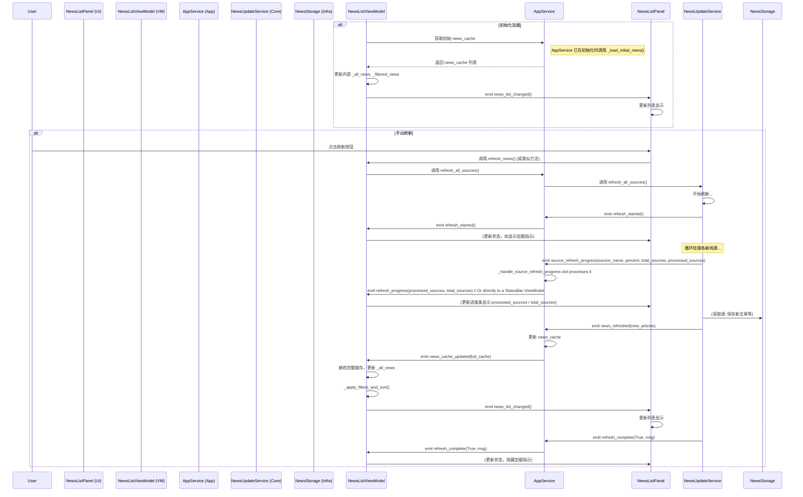
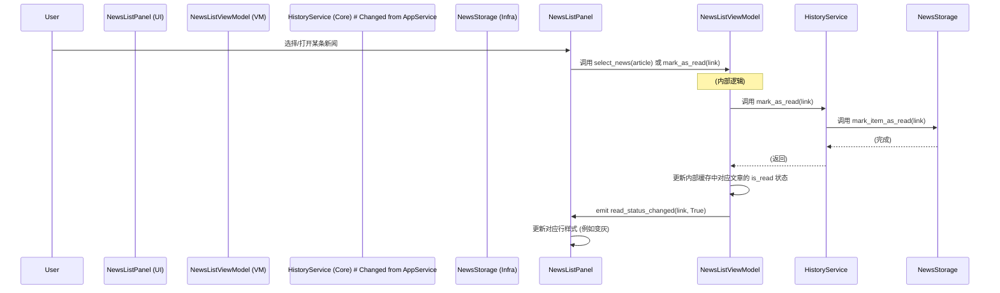
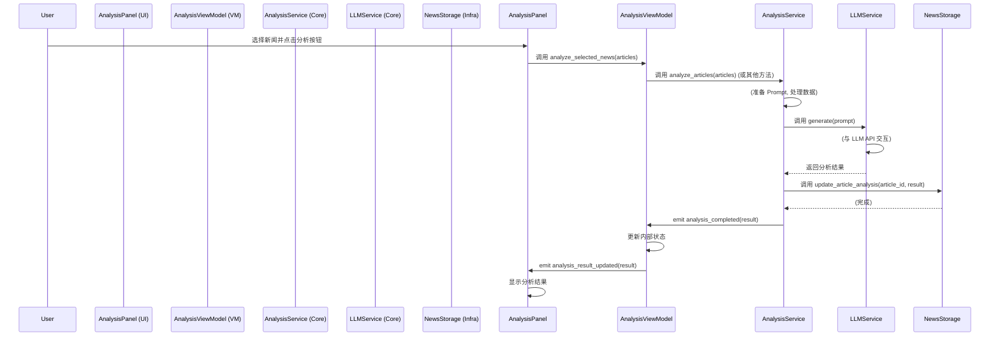
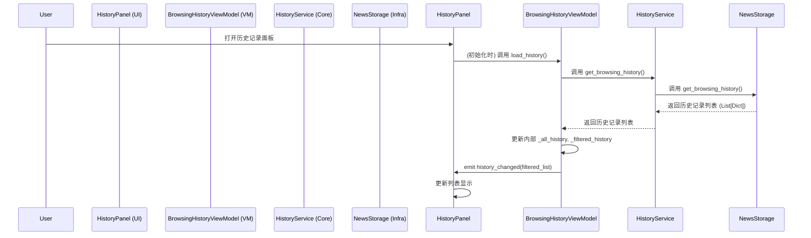
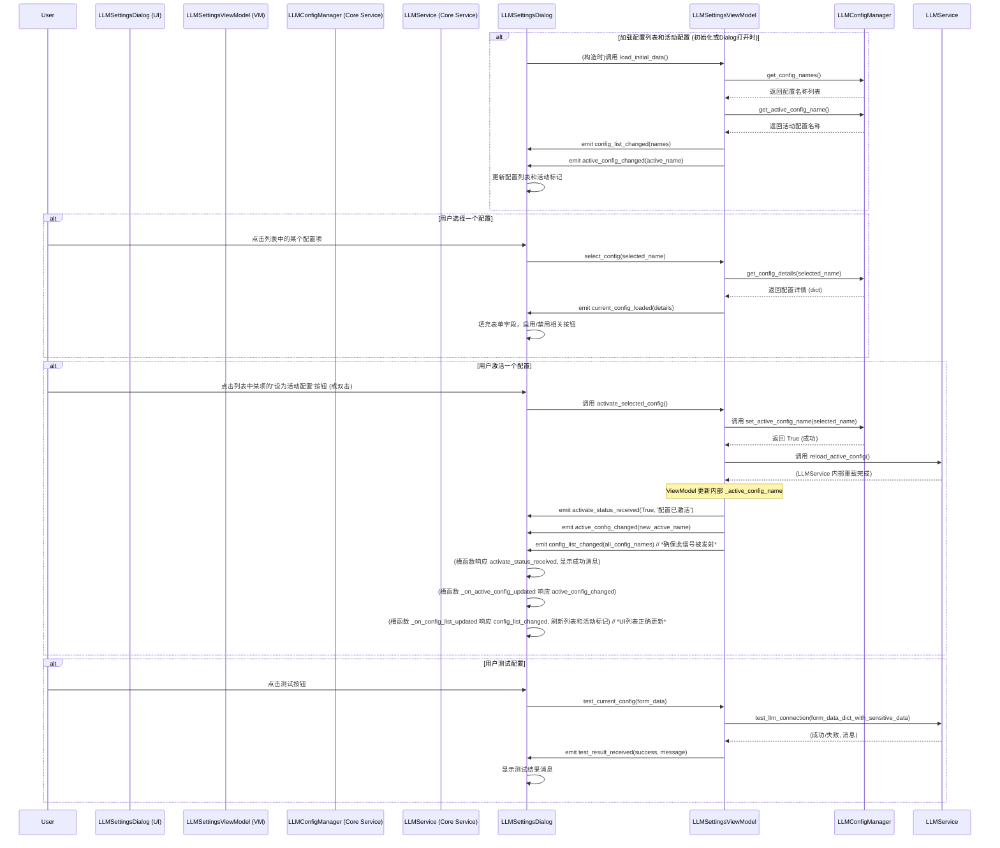

# 04 - UI 与核心交互逻辑

## 1. 核心原则

- **UI 松耦合:** UI 面板 (View) 应通过其对应的 `ViewModel` 与应用核心 (`AppService`, `NewsStorage`) 交互，避免直接调用核心服务。
- **ViewModel 模式:** `ViewModel` (如 `NewsListViewModel`) 作为 View (`NewsListPanel`) 的数据和状态管理器。它从 `AppService` 获取数据，管理视图相关的状态（如过滤、排序），处理 UI 事件，并暴露数据和信号给 View。
- **信号/槽机制:** 状态变更和操作结果通过信号传递。
    - `AppService` -> `ViewModel` (e.g., `AppService.news_refreshed` -> `ViewModel._handle_app_news_refreshed`)
    - `ViewModel` -> View (e.g., `ViewModel.news_list_changed` -> `View._populate_list_widget`, `ViewModel.read_status_changed` -> `View._update_item_read_status`)
    - View -> `ViewModel` (e.g., `QPushButton.clicked` -> `View._on_sort_clicked` -> `ViewModel.sort_news`)
    - `NewsUpdateService` -> `AppService` (e.g., `NewsUpdateService.news_refreshed` -> `AppService._handle_news_refreshed`)
    - `AppService` -> `ViewModel` (e.g., **`AppService.news_cache_updated`** -> `ViewModel._handle_app_news_refreshed`)
    - `ViewModel` -> View (e.g., `ViewModel.news_list_changed` -> `View._populate_list_widget`, `ViewModel.read_status_changed` -> `View._update_item_read_status`)
    - View -> `ViewModel` (e.g., `QPushButton.clicked` -> `View._on_sort_clicked` -> `ViewModel.sort_news`)

## 2. 关键交互流程

*(基于代码分析和 ViewModel 模式)*

1.  **新闻列表加载与更新 (`NewsListPanel` / `NewsListViewModel`):**
    1.  **初始化**: `NewsListPanel` 创建 `NewsListViewModel`，并将 `AppService` 注入 `ViewModel`。
    2.  **连接信号**: `ViewModel` 连接 **`AppService.news_cache_updated`** 信号；`View` 连接 `ViewModel.news_list_changed` 信号。
    3.  **获取初始数据**: `ViewModel` (可能通过 `QTimer.singleShot`) 从 `AppService.news_cache` 加载初始 `List[NewsArticle]` (其中每个 `NewsArticle` 对象的 `publish_time` 字段已经是 `datetime` 类型) 到 `ViewModel._all_news`。
    4.  **初始过滤/排序**: `ViewModel` 调用 `_apply_filters_and_sort()` 处理 `_all_news`，结果存入 `_filtered_news`。
    5.  **通知 View**: `ViewModel` 发射 `news_list_changed` 信号，携带 `_filtered_news` (即 `List[NewsArticle]`)。
    6.  **View 更新**: `NewsListPanel` 的槽函数响应 `news_list_changed` 信号，从 `ViewModel.newsList` (即 `_filtered_news`) 获取 `List[NewsArticle]`。然后，`NewsListPanel` (或其列表项委托) 遍历这个列表，对于每条 `NewsArticle`：
        *   提取所需信息（如 `title`, `source_name`, `publish_time` 等）。
        *   将 `publish_time` (一个 `datetime` 对象) 格式化为用户友好的日期/时间字符串。
        *   在列表控件中创建或更新对应的列表项，显示这些信息。
    7.  **AppService 刷新**: 当 **`NewsUpdateService` 完成刷新并发射 `news_refreshed` 时，`AppService` 的槽函数 (`_handle_news_refreshed`) 被触发，更新其 `news_cache` (确保所有文章数据，包括日期，都已正确解析和转换)，并发射 `news_cache_updated`**。`ViewModel` 的槽函数 (`_handle_app_news_refreshed`) 响应 `news_cache_updated`，获取更新后的 `news_cache` (依然是 `List[NewsArticle]`)，重复步骤 3-5，更新 `_all_news` 和 `_filtered_news`，并通知 View (如步骤 6 所述)。
2.  **用户筛选/排序 (`NewsListPanel` / `NewsListViewModel`):**
    1.  **UI 操作**: 用户与 `NewsListPanel` 上的控件交互 (e.g., 选择分类侧边栏项，点击排序按钮，输入搜索词)。
    2.  **View -> ViewModel**: `NewsListPanel` 的槽函数被触发，调用 `NewsListViewModel` 对应的槽函数 (e.g., `filter_by_category`, `sort_news`, `search_news`)，传递用户输入。
    3.  **ViewModel 状态更新**: `ViewModel` 更新其内部的过滤/排序状态变量 (e.g., `_current_category`, `_sort_column`)。
    4.  **重新计算**: `ViewModel` 调用 `_apply_filters_and_sort()`，使用更新后的状态重新处理 `_all_news`，更新 `_filtered_news`。
    5.  **通知 View**: `ViewModel` 发射 `news_list_changed`，触发 `NewsListPanel` 更新显示。
3.  **已读状态同步 (`NewsListPanel` / `NewsListViewModel`):**
    1.  **UI 操作**: 用户在 `NewsListPanel` 中选择/双击某条新闻。
    2.  **View -> ViewModel**: `NewsListPanel` 的槽函数调用 `NewsListViewModel.select_news(article)` 或 `mark_as_read(link)`。
    3.  **ViewModel -> AppService (持久化)**: `ViewModel` (在 `select_news` 或 `mark_as_read` 内部) 调用 `AppService.mark_as_read(link)`。
    4.  **AppService -> Storage**: `AppService` 调用 `NewsStorage.add_read_item(link)` 并触发保存 (`_save_read_status`)。
    5.  **ViewModel 状态更新 (即时)**: `ViewModel.mark_as_read` **立即**更新其内部缓存 (`_all_news`, `_filtered_news`) 中对应文章的 `is_read` 状态（如果存在）。
    6.  **ViewModel -> View (通知)**: `ViewModel.mark_as_read` 发射 `read_status_changed(link, True)` 信号。
    7.  **View 更新**: `NewsListPanel` 的槽函数 (`_update_item_read_status`) 响应信号，找到对应 `link` 的列表项，并更新其视觉样式 (e.g., 改变字体颜色/样式，通常通过委托 `QStyledItemDelegate` 实现)。
4.  **主题/字体大小更改 (`MainWindow`, `ThemeManager`, `UISettingsManager`):**
    *(流程基本不变，重点是刷新问题)*
    1.  用户通过菜单/对话框触发更改。
    2.  `ThemeManager`/`UISettingsManager` 应用更改 (`QApplication.setStyleSheet/setFont`) 并保存 (`QSettings`)。
    3.  **刷新问题:**
        -   全局应用样式/字体后，Qt 对标准控件的更新可能不及时或不完全。
        -   自定义绘制的控件 (`Delegate`) 必须在其 `paint` 方法中确保使用当前应用的样式和字体。
        -   **缺乏全局强制刷新机制**: 没有标准方法能保证所有现有 UI 控件在样式/字体应用后立即且完全地刷新其外观和布局。需要手动调用 `update()` 或 `polish()`，或者依赖控件自身的更新逻辑，这可能导致不一致。

5.  **单篇新闻分析 (`LLMPanel` / `LLMPanelViewModel` / `AnalysisService`):**
    1.  **UI 操作**: 用户在 `LLMPanel` 中选择一篇文章和一个分析类型 (e.g., 摘要)，点击分析按钮。
    2.  **View -> ViewModel**: `LLMPanel` 的槽函数调用 `LLMPanelViewModel.trigger_analysis(article, analysis_type)`。
    3.  **ViewModel -> AnalysisService**: `LLMPanelViewModel` 调用 `AnalysisService.analyze_single_article(article, analysis_type)`。
    4.  **AnalysisService 协调**: `AnalysisService` 发射 `status_message_updated` (开始分析)，调用 `LLMService.analyze_news`。
    5.  **LLMService -> LLM API**: `LLMService` 与外部 LLM API 交互。
    6.  **LLM API -> LLMService**: 返回分析结果。
    7.  **LLMService -> AnalysisService**: 返回结果字典。
    8.  **AnalysisService 处理结果**: `AnalysisService` 调用 `NewsStorage.save_analysis_result` 保存结果，然后发射 `single_analysis_completed(analysis_type, result_data)` 信号，并更新状态 `status_message_updated` (分析完成)。如果出错，则发射 `analysis_failed`。
    9.  **ViewModel 接收结果**: `LLMPanelViewModel` 的槽函数响应 `single_analysis_completed` 或 `analysis_failed` 信号。
    10. **ViewModel -> View**: `LLMPanelViewModel` 更新其内部状态 (e.g., `analysisResult` 属性)并发射信号通知 `LLMPanel` 更新显示。

## 3. 状态管理问题点 (当前)

*(基于代码分析和文档总结)*

- **`AppService` 耦合度过高:** 核心问题有所缓解（新闻更新、单篇分析已移出）。ViewModel 对 `AppService` 的依赖 (获取数据、调用核心操作如标记已读等) 仍然存在。
- **状态同步链与职责:**
    - 新闻数据: `Storage` (持久化) -> `NewsUpdateService` (抓取/保存) -> `AppService` (接收信号更新 `news_cache`) -> `ViewModel` (`_all_news`, `_filtered_news`) -> View (显示)。链条仍然较长，但职责更清晰。
    - 已读状态: `Storage` (持久化 `read_status.json`, 内存 `read_items` set) -> `AppService` (`mark_as_read`, `is_read` 接口) -> `ViewModel` (调用接口，**并维护自身缓存中的状态**，发射信号) -> View (更新视觉)。ViewModel 承担了部分状态同步责任以提高即时性。
    - 分析结果: `LLM API` -> `LLMService` -> `AnalysisService` (协调、保存) -> `ViewModel` (接收信号) -> View (显示)。结果的持久化由 `AnalysisService` 负责。
- **UI 状态:** 控件自身的瞬时状态 (如按钮按下) 仍在 View 中，而列表展示内容的状态由 `ViewModel` 管理。
- **主题/样式刷新机制不完善:** 这是一个明确的技术债，可能导致 UI bug。
- **ViewModel 职责**: `NewsListViewModel` 除了数据适配，还承担了过滤、排序和部分状态同步（已读）的逻辑，职责相对较重。
- **复杂UI控件自定义排序**: (新增问题点) 实现特定且复杂的自定义排序逻辑，尤其是在 `QTreeWidget` 等控件中（例如，新闻分类导航面板 `IntegratedAnalysisPanel` 中预期的分类树状结构和特定排序），已被证明具有挑战性，相关功能可能被简化或暂时搁置，以优先保证核心功能的稳定性。

## 4. ViewModel 的角色

ViewModel 是 UI (Views/Panels/Dialogs) 和后端服务之间的中介。主要职责包括：

*   **接收 UI 事件**: 响应用户的操作（点击按钮、输入文本、选择列表项等）。
*   **调用核心服务**: 根据 UI 事件，调用**直接依赖**的核心服务 (如 `AppService` 用于某些全局操作，`AnalysisService` 用于分析, `HistoryService` 用于历史记录, `LLMConfigManager` 和 `LLMService` 用于LLM配置管理) 来执行业务逻辑或获取数据。
*   **管理 UI 状态**: 维护与 UI 显示相关的数据和状态（如当前过滤条件、列表数据、加载状态、按钮启用状态等）。
*   **数据转换**: 将从核心服务获取的数据转换为 UI 可以直接显示的格式。
*   **通知 UI 更新**: 通过发射信号 (`pyqtSignal`) 通知其关联的 View/Panel/Dialog 更新显示。

## 5. 交互模式

主要有两种交互模式：

*   **UI -> ViewModel -> Service -> ViewModel -> UI**: 用户操作触发 UI 事件 -> ViewModel 处理事件，调用服务方法 -> 服务执行逻辑（可能涉及存储、网络等），完成后可能直接返回数据或通过信号通知 -> ViewModel 接收数据或信号，更新内部状态 -> ViewModel 发射信号通知 UI 更新。
*   **Service -> ViewModel -> UI**: 后台服务（如 `NewsUpdateService` 完成刷新, `AnalysisService` 完成分析）主动发出信号 -> ViewModel 连接到这些信号，接收数据 -> ViewModel 更新内部状态 -> ViewModel 发射信号通知 UI 更新。

## 6. 关键交互示例

以下是一些典型的交互流程：

### 6.1. 新闻列表加载与刷新

*   **关键点**: `AppService` 维护 `news_cache`，并在 `NewsUpdateService` 完成刷新后更新缓存，最后通过 `news_cache_updated` 将**完整**的缓存列表通知给 `NewsListViewModel`。
    同时，`NewsUpdateService` 会在处理每个新闻源时通过 `source_refresh_progress` 信号报告详细进度（当前源名称、该源的完成百分比、总源数、已处理源数）。`AppService` 监听此信号，并通过其自身的 `refresh_progress` 信号（通常传递已处理源数和总源数）将总体刷新进度转发给UI层，UI层（如主窗口的状态栏或特定的进度显示组件）连接此信号以更新进度条。

### 6.2. 标记新闻为已读

*   **关键点**: `NewsListViewModel` 现在直接调用 `HistoryService` 来处理已读状态的持久化，不再通过 `AppService`。ViewModel 仍然需要更新其内部缓存和通知 UI。

### 6.3. 执行新闻分析

*   **关键点**: `AnalysisViewModel` 直接与 `AnalysisService` 交互来执行分析任务。`AppService` 在此流程中通常不直接参与。

### 6.4. 获取浏览历史

*   **关键点**: `BrowsingHistoryViewModel` 现在直接调用 `HistoryService` 来获取浏览历史数据。

### 6.5. 新闻分析与整合面板 (IntegratedAnalysisPanel) 交互

`IntegratedAnalysisPanel` 是一个功能丰富的对话框，用于对选定的新闻进行多种类型的AI分析和结果展示。其交互有以下特点：

1.  **面板内部的异步操作与UI更新**:
    *   当用户在 `IntegratedAnalysisPanel` 中触发分析操作（例如，点击"开始分析"按钮调用 `_analyze_selected_news` 方法）时，该方法会与 `LLMService` 进行交互以获取分析结果。
    *   分析过程可能是耗时的。为了保持UI响应，`_analyze_selected_news` 在获取到LLM结果后，会通过发射其自身的 `analysis_completed = Signal(dict)` 信号来通知分析已完成。
    *   `IntegratedAnalysisPanel` 在其 `__init__` 方法中，将此 `analysis_completed` 信号连接到其自身的槽函数 `_on_analysis_completed(self, result: dict)`。
    *   `_on_analysis_completed` 槽函数负责接收包含分析结果的字典，并据此更新面板内的UI组件（主要是 `self.result_edit` 文本区域）以向用户展示结果。这种模式有效地将异步的分析任务与UI更新逻辑解耦。

2.  **与 `IntegratedPanelManager` 的交互**:
    *   `IntegratedPanelManager` (位于 `src/ui/managers/integrated_panel_manager.py`) 负责实例化和显示 `IntegratedAnalysisPanel`。
    *   `IntegratedPanelManager` 也会连接到其创建的 `IntegratedAnalysisPanel` 实例的 `analysis_completed` 信号。
    *   **职责区分**:
        *   `IntegratedAnalysisPanel` 内部对 `analysis_completed` 信号的响应主要用于更新其自身的UI元素。
        *   `IntegratedPanelManager` 对该信号的响应则可能用于更全局的任务，例如记录分析事件的日志、更新应用级别的状态（如果需要），或触发其他不直接相关于 `IntegratedAnalysisPanel` 内部视图的通知。
    *   这种双重连接允许面板自治地处理其内部视图更新，同时也让管理器有机会对分析完成事件做出反应。

### 6.6. LLM 配置管理 (LLMSettingsDialog)

*   **关键点**: `LLMSettingsViewModel` 直接与 `LLMConfigManager`（用于配置的CRUD）和 `LLMService`（用于测试连接）交互。`DialogManager` (未在图中显示) 负责在创建 `LLMSettingsDialog` 之前，首先创建 `LLMSettingsViewModel` 的实例。创建 `LLMSettingsViewModel` 时，`DialogManager` 会从 `AppService` 获取并注入 `LLMConfigManager` 和 `LLMService` 这两个核心服务依赖。然后，`DialogManager` 将准备好的 `LLMSettingsViewModel` 实例注入到 `LLMSettingsDialog` 的构造函数中。这种模式（由 `DialogManager` 实例化对话框并注入所需依赖，如服务或管理器实例）也适用于其他由 `DialogManager` 管理的对话框，确保它们能够获取如 `AppService` 或 `ThemeManager` 等必要的上下文。

## 7. 总结

*   ViewModel 是 UI 和核心服务之间的关键纽带。
*   `AppService` 主要负责协调、部分状态管理和信号转发，不再处理所有业务逻辑。
*   ViewModel 应根据其职责**直接依赖**所需的核心服务（如 `AnalysisService`, `HistoryService`, `LLMConfigManager`），而不是所有交互都通过 `AppService` 中转。
*   通过信号/槽机制实现解耦和异步通信。 