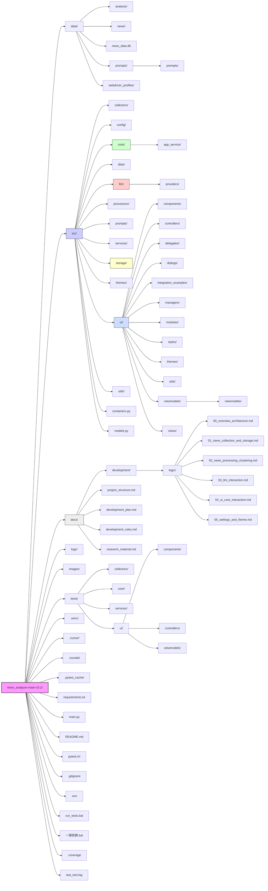

```mermaid
graph LR
    %% Root Level
    root["news_analyzer-main-v3.1/"] --> src_dir["src/"];
    root --> docs_dir["docs/"];
    root --> tests_dir["tests/"];
    root --> logs_dir["logs/"];
    root --> images_dir["images/"];
    root --> data_dir_root["data/"];
    root --> venv_dir[".venv/"];
    root --> cursor_dir_root[".cursor/"];
    root --> vscode_dir_root[".vscode/"];
    root --> pytest_cache_dir_root[".pytest_cache/"];
    root --> requirements_txt_file["requirements.txt"];
    root --> main_py_file["main.py"];
    root --> README_md_file["README.md"];
    root --> pytest_ini_file["pytest.ini"];
    root --> gitignore_file[".gitignore"];
    root --> env_file_root[".env"];
    root --> run_tests_bat_file["run_tests.bat"];
    root --> one_key_bat_file["一键依赖.bat"];
    root --> coverage_file_root[".coverage"];
    root --> last_test_log_file["last_test.log"];

    %% Data Root Level (data/)
    data_dir_root --> data_analysis_subdir["analysis/"];
    data_dir_root --> data_news_subdir["news/"];
    data_dir_root --> data_db_file["news_data.db"];
    data_dir_root --> data_prompts_subdir["prompts/"];
    data_prompts_subdir --> data_prompts_prompts_subdir["prompts/"];
    data_dir_root --> data_webdriver_subdir["webdriver_profiles/"];

    %% Src Level (src/)
    src_dir --> src_collectors_subdir["collectors/"];
    src_dir --> src_config_subdir["config/"];
    src_dir --> src_core_subdir["core/"];
    src_dir --> src_data_subdir["data/"];
    src_dir --> src_llm_subdir["llm/"];
    src_dir --> src_processors_subdir["processors/"];
    src_dir --> src_prompts_subdir["prompts/"];
    src_dir --> src_services_subdir["services/"];
    src_dir --> src_storage_subdir["storage/"];
    src_dir --> src_themes_subdir["themes/"];
    src_dir --> src_ui_subdir["ui/"];
    src_dir --> src_utils_subdir["utils/"];
    src_dir --> src_containers_py_file["containers.py"];
    src_dir --> src_models_py_file["models.py"];

    %% Src Core Level (src/core/)
    src_core_subdir --> src_core_app_service_subdir["app_service/"];

    %% Src LLM Level (src/llm/)
    src_llm_subdir --> src_llm_providers_subdir["providers/"];

    %% Src UI Level (src/ui/)
    src_ui_subdir --> ui_components_subdir["components/"];
    src_ui_subdir --> ui_controllers_subdir["controllers/"];
    src_ui_subdir --> ui_delegates_subdir["delegates/"];
    src_ui_subdir --> ui_dialogs_subdir["dialogs/"];
    src_ui_subdir --> ui_integration_examples_subdir["integration_examples/"];
    src_ui_subdir --> ui_managers_subdir["managers/"];
    src_ui_subdir --> ui_modules_subdir["modules/"];
    src_ui_subdir --> ui_styles_subdir["styles/"];
    src_ui_subdir --> ui_themes_subdir["themes/"];
    src_ui_subdir --> ui_utils_subdir["utils/"];
    src_ui_subdir --> ui_viewmodels_subdir["viewmodels/"];
    src_ui_subdir --> ui_views_subdir["views/"];

    %% Src UI Viewmodels Level (src/ui/viewmodels/)
    ui_viewmodels_subdir --> ui_viewmodels_viewmodels_subdir["viewmodels/"];

    %% Docs Level (docs/)
    docs_dir --> docs_development_subdir["development/"];
    docs_dir --> docs_project_structure_md_file["project_structure.md"];
    docs_dir --> docs_dev_plan_md_file["development_plan.md"];
    docs_dir --> docs_dev_rules_md_file["development_rules.md"];
    docs_dir --> docs_research_md_file["research_material.md"];

    %% Docs Development Level (docs/development/)
    docs_development_subdir --> docs_dev_logic_subdir["logic/"];

    %% Docs Development Logic Level (docs/development/logic/)
    docs_dev_logic_subdir --> logic_overview_arch_md["00_overview_architecture.md"];
    docs_dev_logic_subdir --> logic_news_coll_md["01_news_collection_and_storage.md"];
    docs_dev_logic_subdir --> logic_news_proc_md["02_news_processing_clustering.md"];
    docs_dev_logic_subdir --> logic_llm_interact_md["03_llm_interaction.md"];
    docs_dev_logic_subdir --> logic_ui_core_md["04_ui_core_interaction.md"];
    docs_dev_logic_subdir --> logic_settings_theme_md["05_settings_and_theme.md"];

    %% Tests Level (tests/)
    tests_dir --> tests_collectors_subdir["collectors/"];
    tests_dir --> tests_core_subdir["core/"];
    tests_dir --> tests_services_subdir["services/"];
    tests_dir --> tests_ui_subdir["ui/"];

    %% Tests UI Level (tests/ui/)
    tests_ui_subdir --> tests_ui_components_subdir["components/"];
    tests_ui_subdir --> tests_ui_controllers_subdir["controllers/"];
    tests_ui_subdir --> tests_ui_viewmodels_subdir["viewmodels/"];

    %% Style Adjustments
    style root fill:#f9f,stroke:#333,stroke-width:2px;
    style src_dir fill:#ccf,stroke:#333,stroke-width:1px;
    style src_ui_subdir fill:#cdf,stroke:#333,stroke-width:1px;
    style src_core_subdir fill:#cfc,stroke:#333,stroke-width:1px;
    style src_llm_subdir fill:#fcc,stroke:#333,stroke-width:1px;
    style src_storage_subdir fill:#ffc,stroke:#333,stroke-width:1px;
    style docs_dir fill:#eee,stroke:#333,stroke-width:1px;

``` 